# Remote Code

[](LICENSE)
[](https://www.python.org/)
[](https://nodejs.org/)


A self-hosted web application that lets you use [Claude Code](https://docs.anthropic.com/en/docs/claude-code) CLI remotely from your browser.

Manage Claude Code processes on your server and connect from anywhere via a WebSocket-based terminal. Optionally use Cloudflare Tunnel for secure external access.


  #### [Session management / switching]
  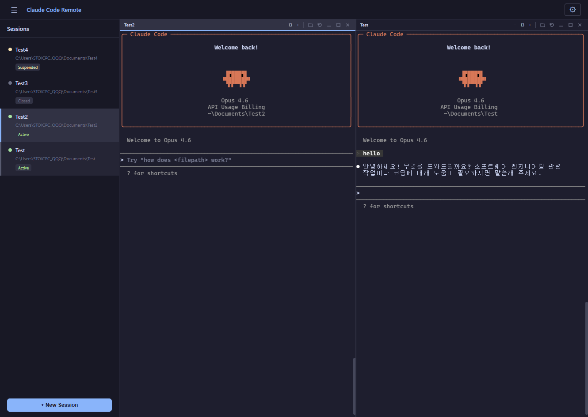


  #### [File explorer]
  | explorer | Code | Image | Audio |
  |------|------|-------|-------|
  | 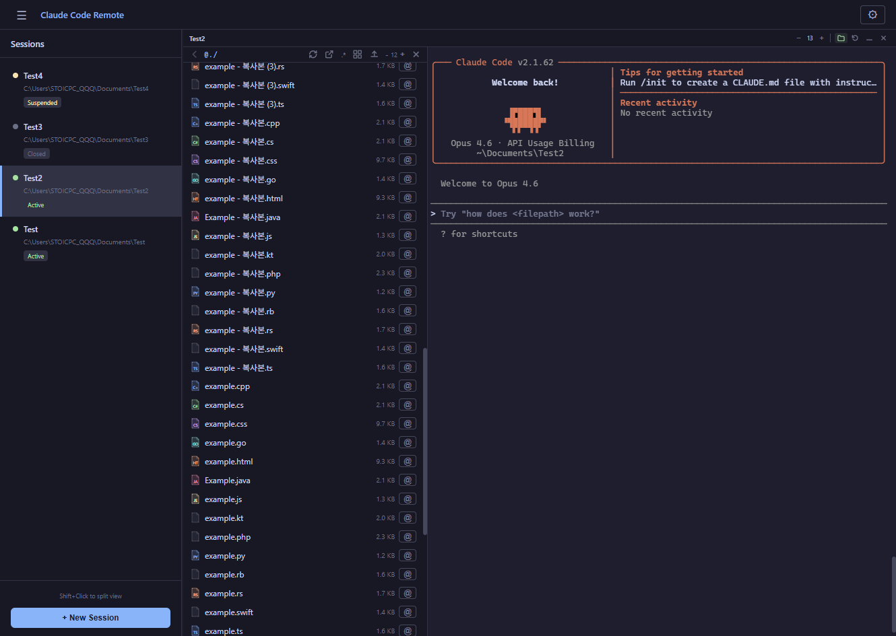 | 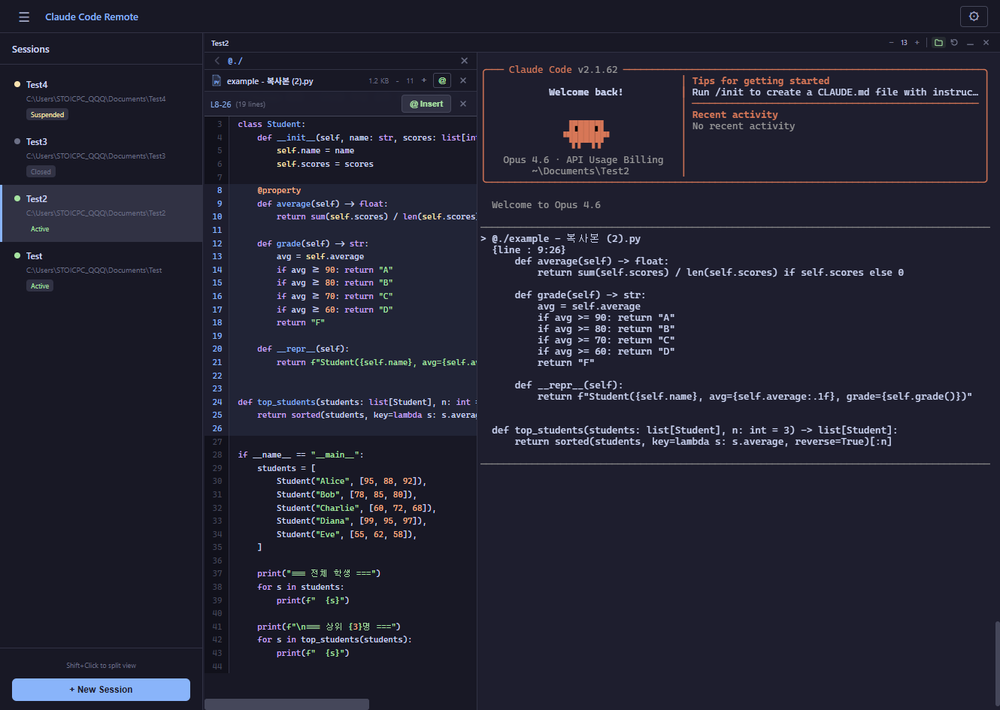 | 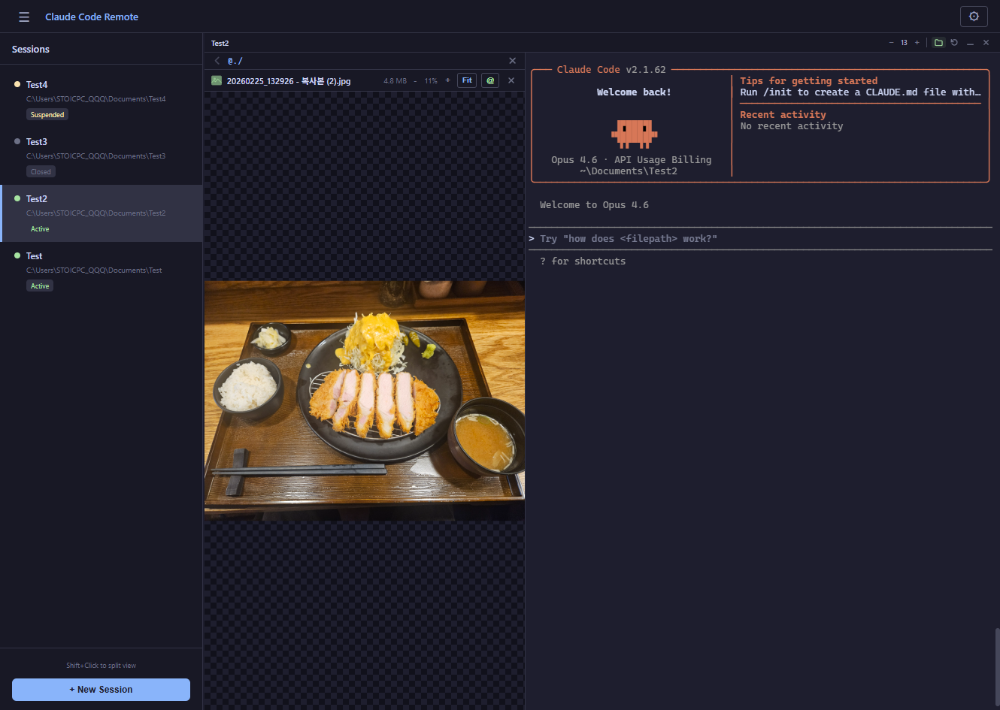 | 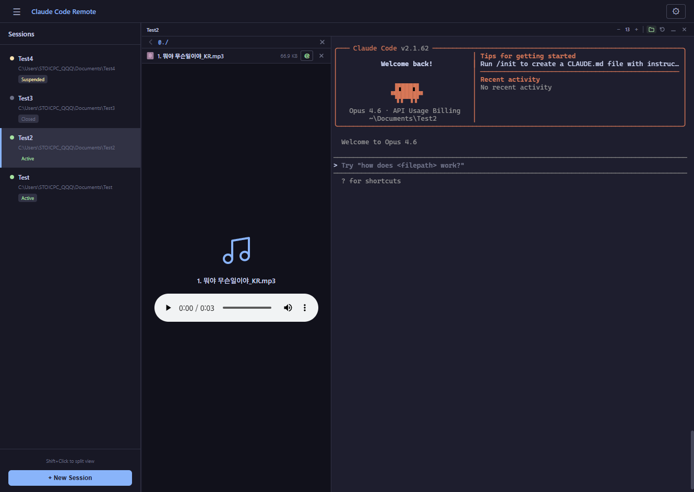 |
  
  #### [Git support]
  | Changes | History |
  |------|-------|
  | 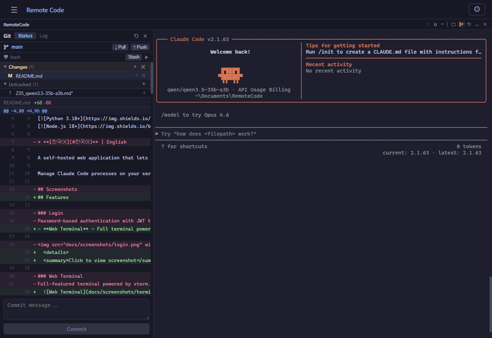 | 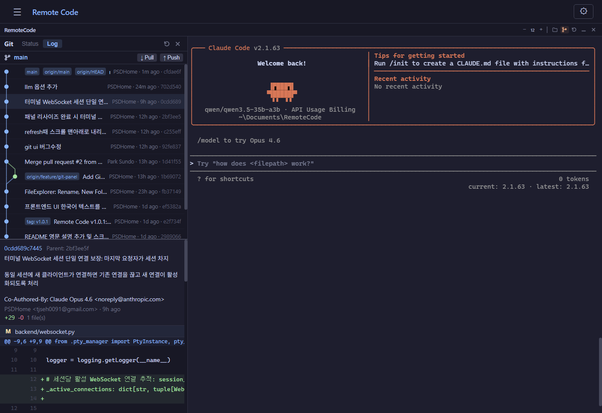


## Features

- **Web Terminal** — Full terminal powered by xterm.js (input, output, resize). Supports real-time interaction with Claude Code CLI processes.

  <details>
  <summary>Click to view screenshot</summary>

  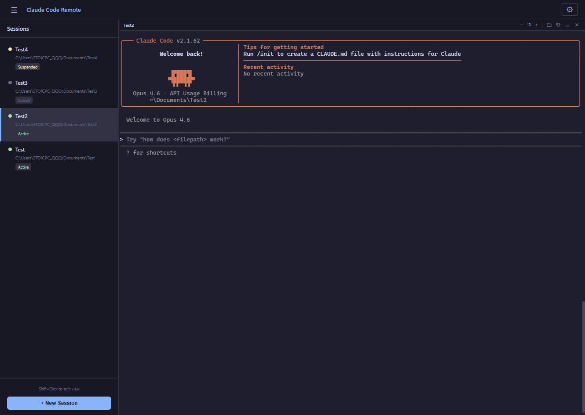

  </details>

- **Multi Session** — Create, switch, suspend, and resume multiple independent Claude Code sessions. Each session runs as a separate PTY process.

- **Split View** — Open two sessions side-by-side using Shift+Click for parallel workflows or comparison tasks.

  <details>
  <summary>Click to view screenshot</summary>

  

  </details>

- **File Explorer** — Browse server filesystem with full file operations: preview code (syntax highlighted), images, and audio files directly in browser; insert file paths into terminal; right-click context menu for preview, open, download, or copy path options.

  <details>
  <summary>Click to view screenshot</summary>

  

  | Code | Image | Audio |
  |------|-------|-------|
  |  |  |  |
  

  </details>

- **File Upload/Download** — Drag & drop files to upload to any directory on the server; download files from server directly to your local machine.

  <details>
  <summary>Click to view screenshot</summary>

  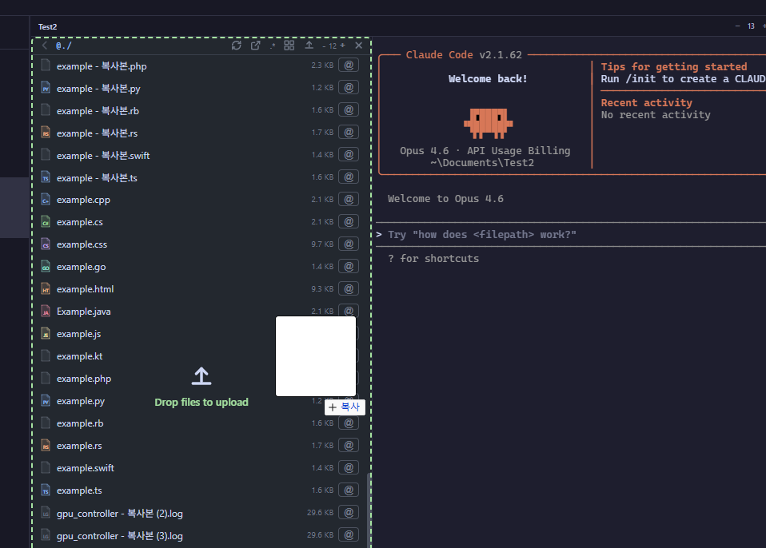

  </details>

- **Folder Browser** — Working directory selection with drive shortcuts and preset folders (Desktop, Documents, Downloads). Create new directories via UI.

  <details>
  <summary>Click to view screenshot</summary>

  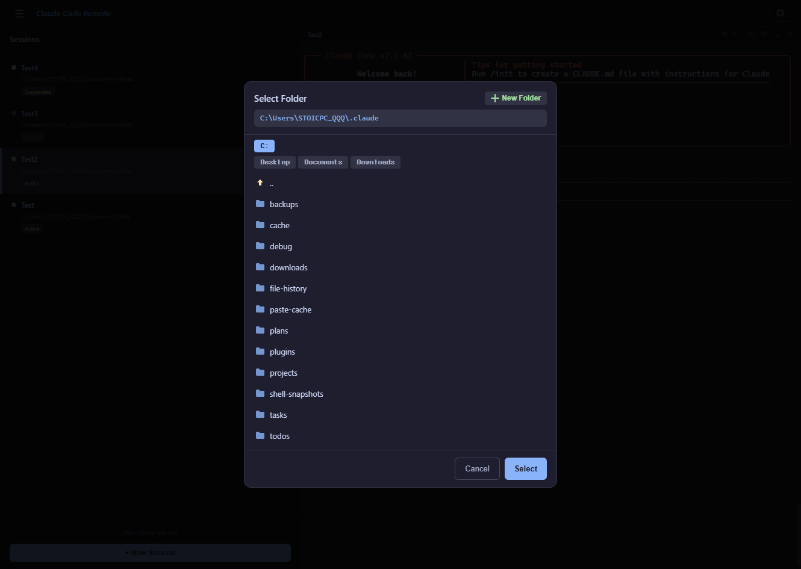

  </details>

- **Session Persistence** — PTY processes survive WebSocket disconnects and can be resumed anytime without losing state.

- **Git Panel** — Visualize Git commit history with ASCII-style commit graph, branch/tag navigation, and commit details view. View file diffs directly in browser; interactively select branches to switch context for diff viewing.

  <details>
  <summary>Click to view screenshot</summary>

  | Changes | History |
  |------|-------|
  |  | 

  </details>

- **Authentication & Security** — Password-based login with JWT token issuance; rate limiting on login API for brute-force protection.

  <details>
  <summary>Click to view screenshot</summary>

  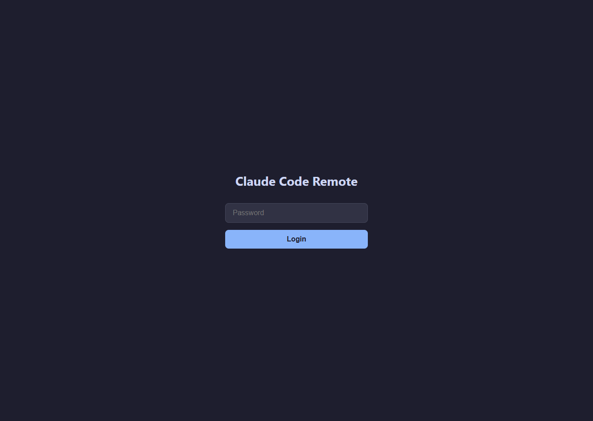

  </details>

- **Cross-Platform** — Works on Windows, Linux, and macOS with automatic PTY backend detection (pywinpty/pexpect).

- **New Session** — Create a new Claude Code session by specifying a work path. Optionally browse folders or auto-create directories.

  <details>
  <summary>Click to view screenshot</summary>

  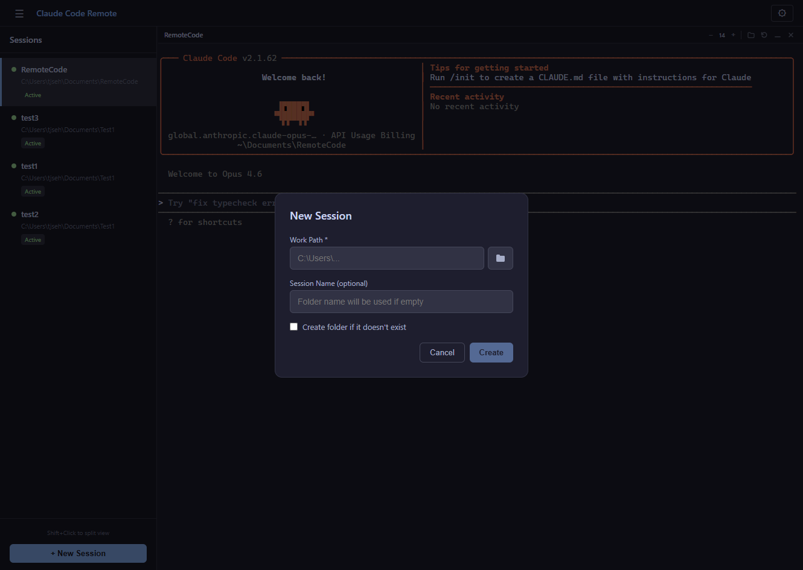

  </details>

## Architecture

```
Browser (React + xterm.js)
    ↕ HTTP / WebSocket
FastAPI Backend
    ↕ PTY (pywinpty / pexpect)
Claude Code CLI Process
```

| Layer | Tech Stack |
|-------|-----------|
| Frontend | React 18, TypeScript, Vite, xterm.js |
| Backend | Python, FastAPI, Uvicorn, WebSocket |
| PTY | pywinpty (Windows) / pexpect (Linux, macOS) |
| DB | SQLite (aiosqlite) — session metadata |
| Auth | JWT (PyJWT), slowapi rate limit |
| Tunnel | Cloudflare Tunnel (optional) |

## Requirements

- **Python** 3.10+
- **Node.js** 18+
- **Claude Code CLI** — `claude` command must be in PATH

## Quick Start

### 1. Setup

```bash
# Windows
.\setup.ps1

# Linux / macOS
chmod +x *.sh
./setup.sh

# Or Make
make setup
```

### 2. Environment Variables

A `.env` file is auto-generated on first run. **Make sure to change the following values:**

```env
CCR_HOST=0.0.0.0
CCR_PORT=8080
CCR_CLAUDE_COMMAND=claude
CCR_PASSWORD=changeme              # Login password
CCR_JWT_SECRET=change-this-secret-key  # JWT signing key (must change)
CCR_JWT_EXPIRE_HOURS=72
CCR_DB_PATH=sessions.db
# CCR_ALLOWED_ORIGINS=https://your-domain.com
```

> The server will not start if `CCR_JWT_SECRET` is left at default.

### 3. Run

```bash
# Development mode (backend hot-reload + Vite dev server)
# Windows
.\start-dev.ps1

# Linux / macOS
./start-dev.sh

# Or Make
make dev
```

```bash
# Production mode (backend serves built frontend)
# Build frontend first
cd frontend && npm run build && cd ..

# Windows
.\start.ps1

# Linux / macOS
./start.sh

# Or Make
make start
```

### 4. Access

- **Dev mode**: `http://localhost:5173` (Vite) → backend proxy
- **Production mode**: `http://localhost:8080`

## Cloudflare Tunnel (Optional)

Use Cloudflare Tunnel for secure external access.

### Quick Tunnel (Temporary URL)

```bash
# Windows
.\tunnel-quick.ps1

# Linux / macOS
./tunnel-quick.sh

# Make
make tunnel-quick
```

### Named Tunnel (Fixed Domain)

Set `CCR_DOMAIN` in `.env`, then:

```bash
# Windows
.\tunnel.ps1

# Linux / macOS
./tunnel.sh

# Make
make tunnel
```

> Named Tunnel requires `cloudflared tunnel create` and DNS setup beforehand.

## Project Structure

```
├── backend/
│   ├── main.py              # FastAPI app, REST API
│   ├── pty_manager.py        # Cross-platform PTY management
│   ├── session_manager.py    # Session lifecycle
│   ├── websocket.py          # WebSocket ↔ PTY relay
│   ├── git_utils.py          # Git operations (log, branch, diff)
│   ├── auth.py               # JWT authentication
│   ├── config.py             # Environment variable config
│   ├── database.py           # SQLite session store
│   └── requirements.txt
├── frontend/
│   ├── src/
│   │   ├── App.tsx           # Main layout, session management
│   │   ├── components/
│   │   │   ├── Terminal.tsx       # xterm.js terminal
│   │   │   ├── SessionList.tsx    # Session list sidebar
│   │   │   ├── FileExplorer.tsx   # File explorer
│   │   │   ├── GitPanel.tsx       # Git commit graph & history view
│   │   │   ├── FolderBrowser.tsx  # Folder selection dialog
│   │   │   ├── NewSession.tsx     # Session creation modal
│   │   │   └── Login.tsx          # Login screen
│   │   └── utils/
│   │       ├── fileIcons.tsx      # File icons
│   │       ├── pathUtils.ts       # Path utilities
│   │       ├── notify.ts          # Browser notifications
│   │       └── gitGraph.ts        # Commit graph rendering utility
│   ├── package.json
│   └── vite.config.ts
├── setup.ps1 / setup.sh
├── start.ps1 / start.sh
├── start-dev.ps1 / start-dev.sh
├── tunnel.ps1 / tunnel.sh
├── tunnel-quick.ps1 / tunnel-quick.sh
└── Makefile
```

## API Endpoints

| Method | Path | Description |
|--------|------|-------------|
| POST | `/api/auth/login` | Password login → JWT token |
| GET | `/api/health` | Health check |
| GET | `/api/browse` | Browse folder list |
| GET | `/api/files` | List files/folders |
| GET | `/api/file-content` | Read text file content |
| GET | `/api/file-raw` | Download raw file |
| POST | `/api/mkdir` | Create folder |
| POST | `/api/upload` | Upload file |
| POST | `/api/open-explorer` | Open OS file explorer |
| GET | `/api/sessions` | List sessions |
| POST | `/api/sessions` | Create session |
| POST | `/api/sessions/:id/suspend` | Suspend session |
| POST | `/api/sessions/:id/resume` | Resume session |
| PATCH | `/api/sessions/:id/rename` | Rename session |
| DELETE | `/api/sessions/:id` | Terminate/delete session |
| WS | `/ws/terminal/:id` | Terminal WebSocket |

## Security Notes

- Change `CCR_JWT_SECRET` to a strong random string
- Change `CCR_PASSWORD` from the default value
- In production, restrict `CCR_ALLOWED_ORIGINS` to your actual domain
- HTTPS (e.g., via Cloudflare Tunnel) is recommended

## License

MIT

