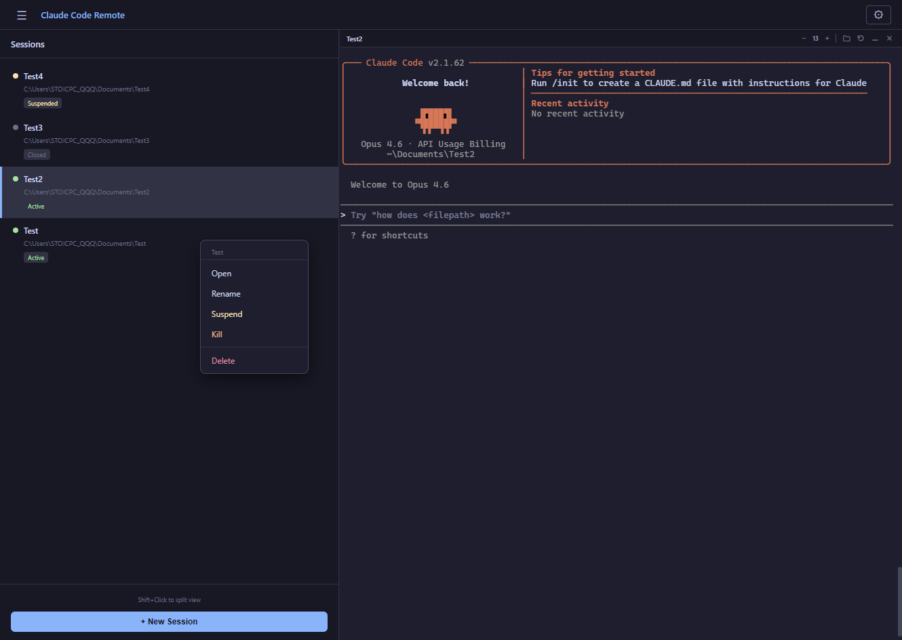
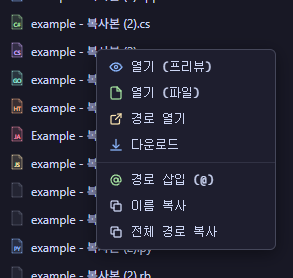

# Remote Code

[](LICENSE)
[](https://www.python.org/)
[](https://nodejs.org/)

> **[한국어](#한국어)** | English

A self-hosted web application that lets you use [Claude Code](https://docs.anthropic.com/en/docs/claude-code) CLI remotely from your browser.

Manage Claude Code processes on your server and connect from anywhere via a WebSocket-based terminal. Optionally use Cloudflare Tunnel for secure external access.

## Screenshots

### Login
Password-based authentication with JWT token issuance.


### Web Terminal
Full-featured terminal powered by xterm.js — supports input, output, resize, and clipboard.


### Split View
Open multiple sessions side-by-side with Shift+Click. Each session runs an independent Claude Code process.


### New Session
Create a new Claude Code session by specifying a work path. Optionally browse folders or auto-create directories.


### Folder Browser
Visual folder selection with drive shortcuts and preset folders (Desktop, Documents, Downloads).


### Session Management
Right-click context menu for session control — Open, Rename, Suspend, Kill, and Delete.



### File Explorer
Browse server filesystem and insert file paths directly into the terminal. Right-click for options — preview, open, download, copy path.

<table>
  <tr>
    <td></td>
    <td></td>
  </tr>
</table>

### File Upload
Drag & drop files onto the explorer panel to upload to the current directory.


### File Preview
Built-in previews for code (syntax highlighted), images, and audio files — no need to download.

<table>
  <tr>
    <td align="center"><strong>Code</strong></td>
    <td align="center"><strong>Image</strong></td>
    <td align="center"><strong>Audio</strong></td>
  </tr>
  <tr>
    <td></td>
    <td></td>
    <td></td>
  </tr>
</table>

## Features

- **Web Terminal** — Full terminal powered by xterm.js (input, output, resize)
- **Multi Session** — Create, switch, suspend, and resume multiple Claude Code sessions
- **Split View** — Open two sessions side-by-side with Shift+Click
- **File Explorer** — Browse server filesystem, preview code/images/audio, insert file paths into terminal
- **File Upload** — Upload files via drag & drop or upload button to any directory on the server
- **File Download** — Download any file from the server directly to your local machine
- **Folder Browser** — Working directory selection UI (drives, preset folders)
- **Session Persistence** — PTY processes survive WebSocket disconnects, reconnect anytime
- **Authentication** — Password login + JWT-based API/WebSocket auth
- **Rate Limiting** — Brute-force protection on login API
- **Cross-Platform** — Windows, Linux, macOS support

## Architecture

```
Browser (React + xterm.js)
    ↕ HTTP / WebSocket
FastAPI Backend
    ↕ PTY (pywinpty / pexpect)
Claude Code CLI Process
```

| Layer | Tech Stack |
|-------|-----------|
| Frontend | React 18, TypeScript, Vite, xterm.js |
| Backend | Python, FastAPI, Uvicorn, WebSocket |
| PTY | pywinpty (Windows) / pexpect (Linux, macOS) |
| DB | SQLite (aiosqlite) — session metadata |
| Auth | JWT (PyJWT), slowapi rate limit |
| Tunnel | Cloudflare Tunnel (optional) |

## Requirements

- **Python** 3.10+
- **Node.js** 18+
- **Claude Code CLI** — `claude` command must be in PATH

## Quick Start

### 1. Setup

```bash
# Windows
.\setup.ps1

# Linux / macOS
chmod +x *.sh
./setup.sh

# Or Make
make setup
```

### 2. Environment Variables

A `.env` file is auto-generated on first run. **Make sure to change the following values:**

```env
CCR_HOST=0.0.0.0
CCR_PORT=8080
CCR_CLAUDE_COMMAND=claude
CCR_PASSWORD=changeme              # Login password
CCR_JWT_SECRET=change-this-secret-key  # JWT signing key (must change)
CCR_JWT_EXPIRE_HOURS=72
CCR_DB_PATH=sessions.db
# CCR_ALLOWED_ORIGINS=https://your-domain.com
```

> The server will not start if `CCR_JWT_SECRET` is left at default.

### 3. Run

```bash
# Development mode (backend hot-reload + Vite dev server)
# Windows
.\start-dev.ps1

# Linux / macOS
./start-dev.sh

# Or Make
make dev
```

```bash
# Production mode (backend serves built frontend)
# Build frontend first
cd frontend && npm run build && cd ..

# Windows
.\start.ps1

# Linux / macOS
./start.sh

# Or Make
make start
```

### 4. Access

- **Dev mode**: `http://localhost:5173` (Vite) → backend proxy
- **Production mode**: `http://localhost:8080`

## Cloudflare Tunnel (Optional)

Use Cloudflare Tunnel for secure external access.

### Quick Tunnel (Temporary URL)

```bash
# Windows
.\tunnel-quick.ps1

# Linux / macOS
./tunnel-quick.sh

# Make
make tunnel-quick
```

### Named Tunnel (Fixed Domain)

Set `CCR_DOMAIN` in `.env`, then:

```bash
# Windows
.\tunnel.ps1

# Linux / macOS
./tunnel.sh

# Make
make tunnel
```

> Named Tunnel requires `cloudflared tunnel create` and DNS setup beforehand.

## Project Structure

```
├── backend/
│   ├── main.py              # FastAPI app, REST API
│   ├── pty_manager.py        # Cross-platform PTY management
│   ├── session_manager.py    # Session lifecycle
│   ├── websocket.py          # WebSocket ↔ PTY relay
│   ├── auth.py               # JWT authentication
│   ├── config.py             # Environment variable config
│   ├── database.py           # SQLite session store
│   └── requirements.txt
├── frontend/
│   ├── src/
│   │   ├── App.tsx           # Main layout, session management
│   │   ├── components/
│   │   │   ├── Terminal.tsx       # xterm.js terminal
│   │   │   ├── SessionList.tsx    # Session list sidebar
│   │   │   ├── FileExplorer.tsx   # File explorer
│   │   │   ├── FolderBrowser.tsx  # Folder selection dialog
│   │   │   ├── NewSession.tsx     # Session creation modal
│   │   │   └── Login.tsx          # Login screen
│   │   └── utils/
│   │       ├── fileIcons.tsx      # File icons
│   │       ├── pathUtils.ts       # Path utilities
│   │       └── notify.ts          # Browser notifications
│   ├── package.json
│   └── vite.config.ts
├── setup.ps1 / setup.sh
├── start.ps1 / start.sh
├── start-dev.ps1 / start-dev.sh
├── tunnel.ps1 / tunnel.sh
├── tunnel-quick.ps1 / tunnel-quick.sh
└── Makefile
```

## API Endpoints

| Method | Path | Description |
|--------|------|-------------|
| POST | `/api/auth/login` | Password login → JWT token |
| GET | `/api/health` | Health check |
| GET | `/api/browse` | Browse folder list |
| GET | `/api/files` | List files/folders |
| GET | `/api/file-content` | Read text file content |
| GET | `/api/file-raw` | Download raw file |
| POST | `/api/mkdir` | Create folder |
| POST | `/api/upload` | Upload file |
| POST | `/api/open-explorer` | Open OS file explorer |
| GET | `/api/sessions` | List sessions |
| POST | `/api/sessions` | Create session |
| POST | `/api/sessions/:id/suspend` | Suspend session |
| POST | `/api/sessions/:id/resume` | Resume session |
| PATCH | `/api/sessions/:id/rename` | Rename session |
| DELETE | `/api/sessions/:id` | Terminate/delete session |
| WS | `/ws/terminal/:id` | Terminal WebSocket |

## Security Notes

- Change `CCR_JWT_SECRET` to a strong random string
- Change `CCR_PASSWORD` from the default value
- In production, restrict `CCR_ALLOWED_ORIGINS` to your actual domain
- HTTPS (e.g., via Cloudflare Tunnel) is recommended

## License

MIT

---

# 한국어

브라우저에서 [Claude Code](https://docs.anthropic.com/en/docs/claude-code) CLI를 원격으로 사용할 수 있는 셀프 호스팅 웹 애플리케이션입니다.

서버에서 Claude Code 프로세스를 관리하고, WebSocket 기반 터미널을 통해 어디서든 접속할 수 있습니다. Cloudflare Tunnel을 연결하면 외부 네트워크에서도 안전하게 사용 가능합니다.

## 주요 기능

- **웹 터미널** — xterm.js 기반 풀 터미널 (입력, 출력, 리사이즈)
- **멀티 세션** — 여러 Claude Code 세션을 동시에 생성·전환·일시정지·재개
- **분할 뷰** — Shift+Click으로 두 세션을 나란히 표시
- **파일 탐색기** — 서버 파일시스템 브라우징, 코드/이미지/오디오 미리보기, 경로 삽입
- **파일 업로드** — 드래그 앤 드롭 또는 업로드 버튼으로 서버에 파일 업로드
- **파일 다운로드** — 서버의 파일을 로컬로 직접 다운로드
- **폴더 브라우저** — 작업 디렉토리 선택 UI (드라이브, 프리셋 폴더)
- **세션 유지** — WebSocket 끊김 시에도 PTY 프로세스 유지, 재연결 가능
- **인증** — 패스워드 로그인 + JWT 토큰 기반 API/WebSocket 인증
- **Rate Limiting** — 로그인 API 브루트포스 방지
- **크로스 플랫폼** — Windows, Linux, macOS 지원

## 보안 참고사항

- `CCR_JWT_SECRET`을 반드시 강력한 랜덤 문자열로 변경하세요
- `CCR_PASSWORD`를 기본값에서 변경하세요
- 프로덕션에서는 `CCR_ALLOWED_ORIGINS`를 실제 도메인으로 제한하세요
- HTTPS 환경(Cloudflare Tunnel 등)에서 사용을 권장합니다

> 설치 및 사용법은 위 영문 섹션을 참고하세요. (Setup and usage instructions are in the English section above.)
