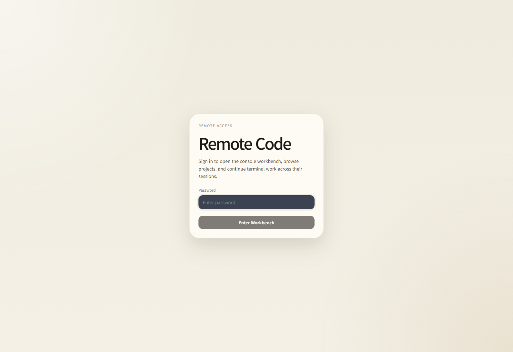
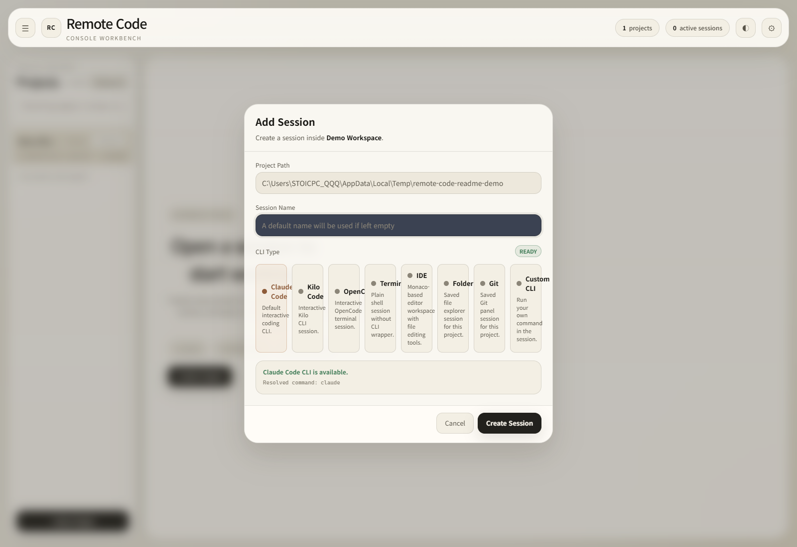
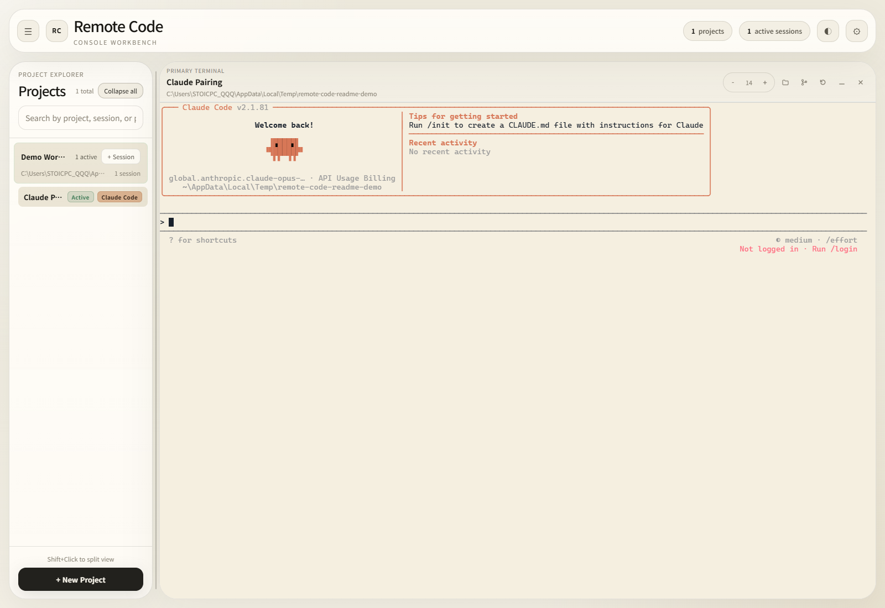
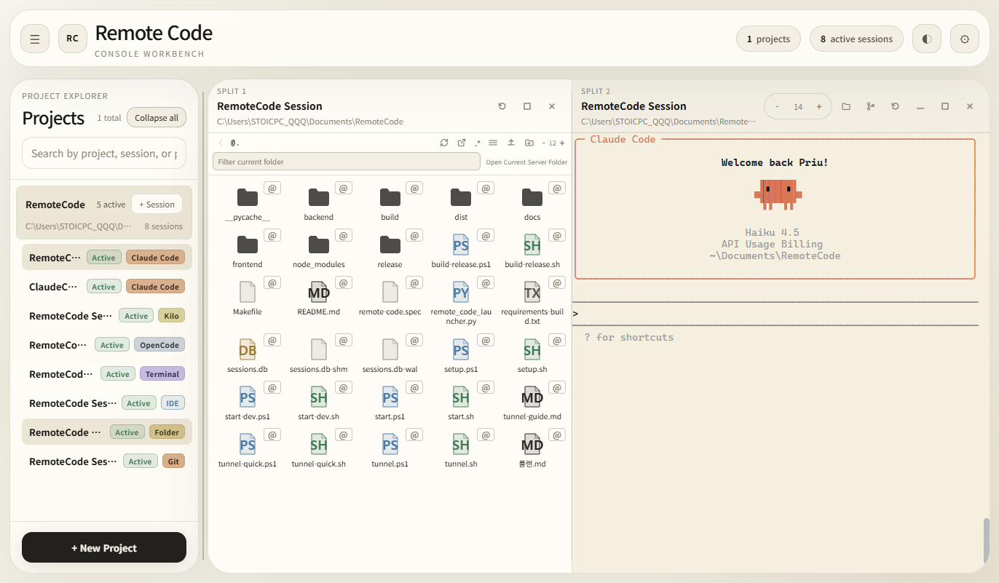
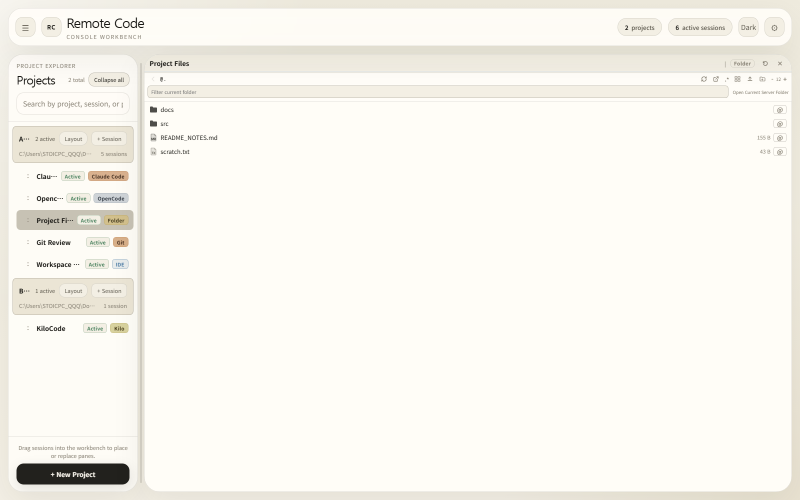
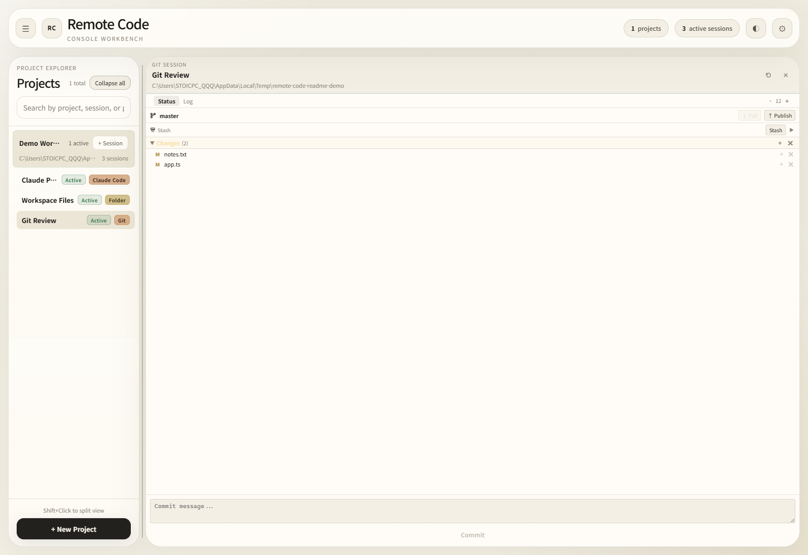

# Remote Code


[](https://www.python.org/)
[](https://nodejs.org/)

Remote Code is a self-hosted browser workbench for terminal-based coding workflows.
It gives you a persistent web workspace for Claude Code sessions, split views, file browsing, Git review, and IDE panels without moving your project off your machine.

## Why Remote Code

- Run coding sessions in the browser while keeping files and CLI tools on your own host.
- Reopen projects and sessions without rebuilding your workspace every time.
- Combine terminal, File Explorer, Git, and IDE panels in one interface.
- Use split view when you want two active contexts side by side.
- Ship it as a source install or as a packaged desktop launcher.

## Key Capabilities

| Capability | What it does |
| --- | --- |
| Claude Code Sessions | Start and reopen browser-based Claude Code workspaces backed by a real local CLI process. |
| Persistent Projects | Group sessions under a fixed workspace path so terminals and panels stay attached to the same codebase. |
| Split View | Open two active sessions side by side for parallel work, review, or debugging. |
| File Explorer | Browse folders, preview files, upload, download, rename, delete, and create folders from the UI. |
| Git Panel | Inspect status, diffs, history, branches, stash, pull, push, and commit actions without leaving the browser. |
| IDE Workspace | Open a Monaco-based editor session with file editing and language-aware tooling. |
| Flexible Session Types | Use `claude`, `kilo`, `opencode`, `terminal`, `custom`, `folder`, `git`, and `ide` sessions from the same app. |

## Feature Tour

### Login



*Password-protected entry keeps the browser client simple while the backend owns the authenticated session cookie.*

### Create a Session



*Create a Claude Code, terminal, File Explorer, Git, IDE, or custom CLI session inside a project workspace.*

### Claude Code Session



*Use Claude Code in the browser while the real CLI continues to run on your host machine.*

### Split View



*Shift-click a second session to open two active panels side by side.*

### File Explorer



*Browse the workspace, inspect files, and manage folders without dropping back to the system file manager.*

### Git Panel



*Review changes, inspect diffs, and manage repository actions from a dedicated Git session.*

## Requirements

- Python 3.10+
- Node.js 18+ for source builds
- At least one CLI available in `PATH`
  - `claude` for Claude Code sessions
  - `kilo` for Kilo Code sessions
  - `opencode` for OpenCode and OpenCode Web sessions

Remote Code does not bundle those CLIs for you. The packaged app and the source install both expect the selected CLI to already exist on the host.

## Getting Started

### Option A: Download and Run from Releases

1. Open the GitHub Releases page and download the archive for your platform.
2. Extract the archive.
3. Launch the packaged app.
   - Windows: run `Remote Code/Remote Code.exe`
   - macOS: open `Remote Code.app`
4. On first launch, the app starts the local backend and opens the browser automatically.
5. Sign in with the password stored in the runtime `.env` file and change it before exposing the app outside your machine.

Runtime data is stored outside the repository:

- Windows: `%APPDATA%\Remote Code`
- macOS: `~/Library/Application Support/Remote Code`

The packaged launcher stores its runtime `.env` and `sessions.db` there. It also generates a secure JWT secret automatically when needed.

### Option B: Run from Source

1. Clone the repository.

```bash
git clone <your-repo-url>
cd RemoteCode
```

2. Install dependencies.

```bash
# Windows
.\setup.ps1

# Linux / macOS
chmod +x *.sh
./setup.sh

# Optional
make setup
```

3. Review `.env`.

```env
CCR_HOST=0.0.0.0
CCR_PORT=8080
CCR_CLAUDE_COMMAND=claude
CCR_KILO_COMMAND=kilo
CCR_OPENCODE_COMMAND=opencode
CCR_PASSWORD=changeme
CCR_JWT_SECRET=change-this-secret-key
CCR_JWT_EXPIRE_HOURS=72
CCR_DB_PATH=sessions.db
```

Minimum changes before real use:

- Set `CCR_PASSWORD` to a real password.
- Set `CCR_JWT_SECRET` to a secure random string.
- Set `CCR_ALLOWED_ORIGINS` in production if you expose the app behind a domain.

4. Start the app.

```bash
# Production mode
# Windows
.\start.ps1

# Linux / macOS
./start.sh

# Optional
make start
```

5. Open `http://localhost:8080` and sign in with `CCR_PASSWORD`.

#### Development Mode

Use development mode when you want the Vite frontend and the reloading backend:

```bash
# Windows
.\start-dev.ps1

# Linux / macOS
./start-dev.sh

# Optional
make dev
```

Development mode serves the frontend at `http://localhost:5173` and proxies API and WebSocket traffic to the backend.

#### Optional Desktop Launcher in Source Mode

You can also launch the local packaged-style runner directly from source:

```bash
python remote_code_launcher.py
```

## Basic Usage

1. Sign in with the configured password.
2. Create a project and point it at a workspace folder.
3. Add a `Claude Code` session to start a browser terminal backed by the local CLI.
4. Add `Folder`, `Git`, or `IDE` sessions for the same project when you need dedicated panels.
5. Shift-click a second active session in the sidebar to open split view.
6. Suspend, resume, rename, reorder, or delete sessions from the project rail.

## Configuration

Most users only need a few settings:

| Variable | Purpose |
| --- | --- |
| `CCR_PORT` | Backend port for the app |
| `CCR_PASSWORD` | Password used by the login screen |
| `CCR_JWT_SECRET` | Secret used to sign auth tokens |
| `CCR_CLAUDE_COMMAND` | Command used for Claude Code sessions |
| `CCR_KILO_COMMAND` | Command used for Kilo sessions |
| `CCR_OPENCODE_COMMAND` | Command used for OpenCode sessions |
| `CCR_DB_PATH` | SQLite database path |
| `CCR_ALLOWED_ORIGINS` | Allowed browser origins for production deployments |

For the full list, see [docs/configuration.md](docs/configuration.md).

## Session Types

| Session Type | Description |
| --- | --- |
| `claude` | Claude Code CLI session |
| `kilo` | Kilo Code CLI session |
| `opencode` | OpenCode terminal session |
| `terminal` | Plain shell session |
| `custom` | User-provided command with optional custom exit command |
| `folder` | Saved File Explorer panel |
| `git` | Saved Git panel |
| `ide` | Monaco-based editor workspace |

## Build a Release

If you want to produce distributable archives yourself:

```bash
# Windows
.\build-release.ps1

# macOS
chmod +x build-release.sh
./build-release.sh

# Optional
make build-release
```

The packaged output is written to `release/`.

## Deployment and Advanced Topics

- [docs/README.md](docs/README.md): documentation index
- [docs/configuration.md](docs/configuration.md): runtime settings and environment variables
- [docs/deployment.md](docs/deployment.md): deployment and tunnel guidance
- [docs/backend-api.md](docs/backend-api.md): REST and WebSocket reference
- [docs/architecture.md](docs/architecture.md): backend and frontend architecture
- [docs/websocket-protocol.md](docs/websocket-protocol.md): terminal WebSocket behavior
- [docs/verification-checklist.md](docs/verification-checklist.md): smoke-test checklist after changes

## Security Notes

- Change `CCR_PASSWORD` before using the app beyond local testing.
- Never leave `CCR_JWT_SECRET` at the insecure default.
- Prefer HTTPS or a trusted tunnel when exposing the app externally.
- Restrict `CCR_ALLOWED_ORIGINS` for production deployments.

## License

MIT
